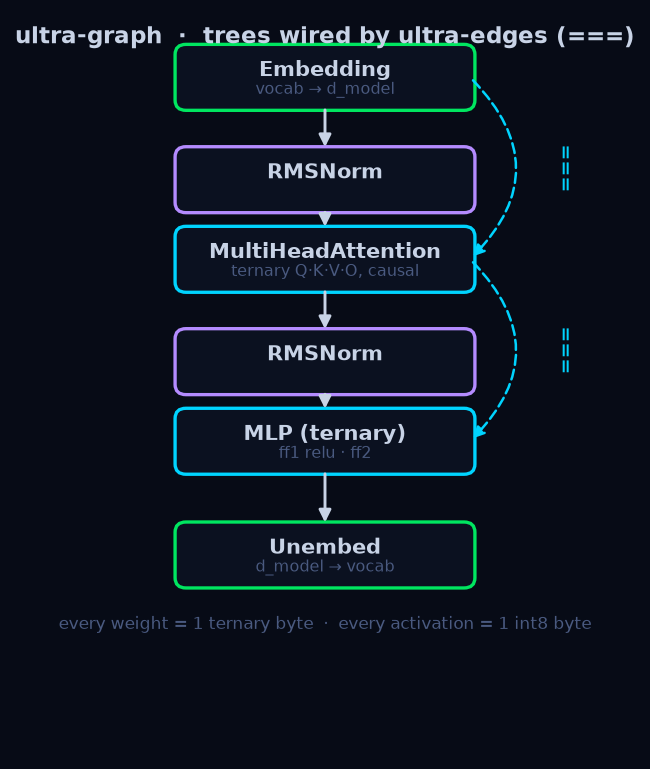
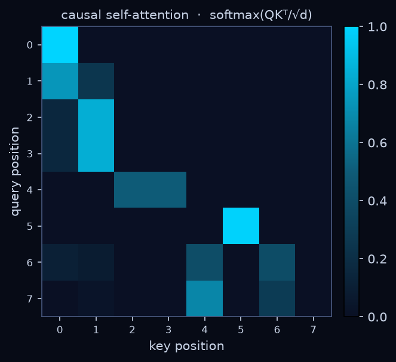
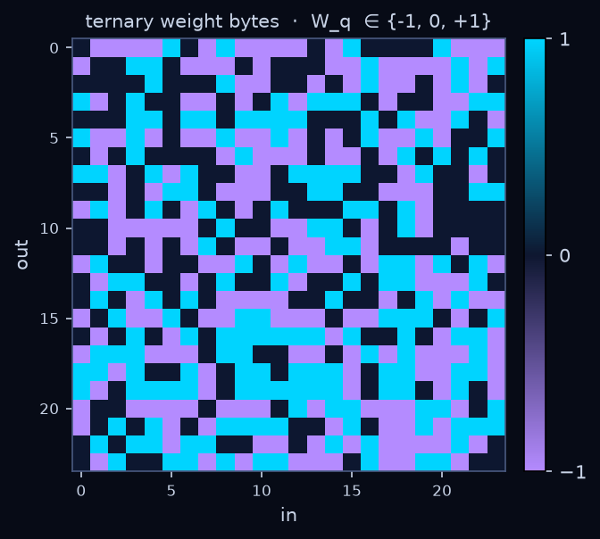

# ultragraph

[](https://github.com/peterlodri-sec/ultra-graph/actions/workflows/ci.yml)
[](pyproject.toml)
[](LICENSE)

A pure-Python (+ numpy) **byte-graph that is a 1-bit (ternary) LLM**.

> **genesis** `251e6ea` · themed after [pocoo.vaked.dev](https://pocoo.vaked.dev)


Three levels:

| level | unit | storage |
|-------|------|---------|
| micro | **node** / **edge** | **1 byte each** — `int8` activation / ternary weight `{-1,0,+1}` |
| meso  | **tree** | a whole graph == one net/module (a Linear/MLP block) |
| macro | **ultra-edge** (`===`) | typed wiring between trees → the **ultra-graph** = the model |

Weights are ternary (BitNet b1.58 style); activations are int8. Full-precision
"master" weights live in an ad-hoc side store during training; the byte buffers are
the deployed state. Training uses a straight-through estimator (STE).

## Illustrations

Real outputs from a trained ternary mini-GPT — regenerate with `uv run python assets/make_figures.py`:

| ultra-graph | causal attention | ternary weight bytes |
|:---:|:---:|:---:|
|  |  |  |

Left: the model as an **ultra-graph** — trees wired by ultra-edges (`===`), with residual skips.
Middle: **real** causal self-attention weights (lower-triangular → no peeking at the future).
Right: a trained query projection's weight bytes, each ∈ {−1, 0, +1}.

## Install

```sh
pip install ultragraph-1bit    # then: import ultragraph
# or from source (Python >=3.13, free-threading ready):
uv sync
```

## Dunder API

`>>` is overloaded by operand type:

```python
import numpy as np
from ultragraph import Tree, UltraGraph, Tensor, mlp, SGD

# micro-edges inside a sparse tree
g = Tree(4, "g")
g[0] >> g[1]        # node >> node  -> micro-edge
g[2] = 7            # set a node byte
print(len(g), 2 in g, list(g))

# ultra-edges between trees
ug = UltraGraph()
a = ug.add(Tree.dense(8, 16, "a"))
b = ug.add(Tree.dense(16, 4, "b", act="none"))
a >> b              # tree >> tree -> ultra-edge (plain)
a.wire(b, "residual")
```

## Train a tiny ternary net

```python
ug = mlp([4, 16, 2])                 # dense ternary linear trees wired plain
opt = SGD(ug, lr=0.3, momentum=0.9)
x = Tensor(np.random.randn(32, 4).astype("float32"))
for _ in range(300):
    loss = ug.forward(x).cross_entropy(y)
    opt.zero_grad(); loss.backward(); opt.step()   # step() re-quantizes weights
```

See `examples/char_lm.py` (MLP LM), `examples/transformer_lm.py` (single-head attention),
`examples/mini_gpt.py` (batched **multi-head** attention + **RMSNorm** + **Adam**),
`examples/gpt_lm.py` (the whole stack: **`ByteTokenizer` → `GPT` → train → stream**), and
`examples/mesh_lm.py` (a **`Mesh`** of GPT experts, gradient accumulation, joint decode)
for end-to-end char/byte-level ternary language models.

```python
from ultragraph import Embedding, MultiHeadAttention, RMSNorm, linear_tree, Adam
# pre-norm transformer block over a [B, T, d_model] sequence:
#   x = x + mha(norm1(x));  x = x + ff2(ff1(norm2(x)))
```

## A whole ternary GPT

```python
from ultragraph import GPT

m = GPT(vocab=256, d_model=128, n_layers=4, n_heads=4, max_len=256)  # RoPE + KV-cache
logits = m(ids)                       # ids [B, T] -> logits [B, T, vocab]
out = m.generate([72, 105], n_new=64, temperature=0.8, top_k=40, top_p=0.9,
                 repetition_penalty=1.3, stop=10, seed=0)   # stop on newline byte

for tok in m.generate([72, 105], n_new=64, temperature=0.8, stream=True):
    print(tok, end=" ", flush=True)   # token-by-token
m.save("gpt.npz")                     # fp32 masters; reload onto the same architecture

# a true 1-bit-on-disk checkpoint: bit-packed ternary bytes, no fp32 masters.
m.save_deployed("gpt.q.npz")          # ~10x smaller, inference-only
deployed = GPT.load_deployed("gpt.q.npz")   # byte-exact logits, runs from the trits
```

The deployed checkpoint stores weights at their true **~1.6 bits/weight** density (5
ternary values per byte) plus the tiny fp32 pieces (embedding, norm gains, biases).
On an 858k-param model that's **3.4 MB → 334 KB**, and `deployed(ids)` gives logits
identical to the trained model — `Tree.forward` runs straight from the stored bytes.

## A mesh of minds

```python
from ultragraph import GPT, Mesh

experts = [GPT(vocab=256, d_model=64, n_layers=2, n_heads=4) for _ in range(4)]
mesh = Mesh(experts, vocab=256, top_k=2)     # a learned router mixes full models
logits = mesh(ids)                           # Σ_e gate(ids)_e · expert_e(ids)
text = mesh.generate([72, 105], n_new=64, temperature=0.8)   # joint KV-cached decode
```

`Mesh` lifts `nn.MoE`'s routing to whole networks: a small ternary router reads the
sequence and mixes the experts' logits per sequence (soft, or top-k). Router and every
expert train together — a graph of minds, still all ternary bytes underneath.

`generate` decodes with a per-layer **KV-cache**; since activations are quantized
per token, a cached step is byte-for-byte the full-forward result at that position.
Positions come from **RoPE** (rotary embeddings) — relative, and `offset`-aware so
they line up across cached steps.

## Guide — common recipes

| Goal | Command |
|------|---------|
| Install | `pip install ultragraph-1bit` (extras: `viz`, `mcp`, `wiki`) |
| Train a byte-level GPT | `uv run python examples/gpt_lm.py` |
| Mixture of full models | `uv run python examples/mesh_lm.py` |
| 1-bit Latin LLM (Anonymus) | `fetch_gesta.py` → `anonymus_lm.py` |
| 1-bit Hungarian LLM (resumable) | `fetch_hungarian.py` → `hungarian_lm.py` |
| Enrich the corpus (no LLM) | `uv run --extra wiki python examples/enrich_corpus.py` |
| History graph — curated | `uv run python examples/hungarian_history.py` |
| History graph — live from Wikipedia | `uv run --extra wiki python examples/hungarian_history_live.py` |
| Serve over MCP (SSE) | `uv run --extra mcp python mcp_server/server.py` |
| Dev container | open in VS Code → *Reopen in Container* |

## Ternary language models on real corpora

Two byte-level ternary `GPT`s trained end-to-end on public-domain text; both deploy to
tiny bit-packed checkpoints that run from the trits alone:

- **Latin** — `examples/anonymus_lm.py` on the *Gesta Hungarorum* of Anonymus (c. 1200),
  the Hungarian founding chronicle (~94 KB) → **196 KB** checkpoint.
  Sample: `GPT.load_deployed("examples/data/anonymus.gpt.npz")` →
  *"Almus dux … dux cum patis se … terras suis …"*.
- **Hungarian** — `examples/hungarian_lm.py` on ~450 KB of public-domain Hungarian
  literature (Arany János + prose, pulled from Project Gutenberg by `fetch_hungarian.py`).
  Training is **resumable** — it saves the fp32 masters + step state and continues across
  runs (`TOTAL`/`STEPS` env vars, periodic checkpoints), so it converges past any
  wall-clock cap.

```python
from ultragraph import GPT, ByteTokenizer
tok = ByteTokenizer()
m = GPT.load_deployed("examples/data/hungarian.gpt.npz")
print(tok.decode(m.generate(tok.encode("A magyar "), n_new=90, temperature=0.8, top_p=0.9)))
```

**Corpus tooling** — `examples/enrich_corpus.py` is a **non-LLM** gatherer: it pulls
grounded facts from Hungarian Wikipedia (via `ultragraph.wiki`), turns them into
definition + `Kérdés:/Válasz:` lines, dedups against the corpus, and appends
(idempotent, re-runnable).

## Knowledge graphs — curated & live

The byte-graph data model doubles as a knowledge graph: entities are `Tree` nodes,
relations are micro-edges, and higher-level structure is ultra-edges (`===`).

- **Curated** — `examples/hungarian_history.py` builds Hungarian history as one
  ultra-graph (13 eras, 59 nodes) and renders a themed timeline SVG.
- **Live** — `examples/hungarian_history_live.py` builds it *dynamically* from
  **hu.wikipedia** via `ultragraph.wiki.build_wiki_graph`, scraping pages + links (with
  an on-disk cache) into a sparse `Tree`.

## MCP server

`mcp_server/server.py` exposes the library over MCP (SSE transport) with tools
`anonymus_generate`, `ultragraph_info`, and `tokenize_preview`:

```sh
uv run --extra mcp python mcp_server/server.py   # -> http://127.0.0.1:8000/sse
```

## BMad agents

Three BMad agents live under `skills/` to help develop and use the library:

| Agent | Folder | What it does |
|-------|--------|-------------|
| **ByteSmith** 🔬 | `skills/ultragraph-dev/` | Byte-graph coding agent — writes autograd ops, wires trees, trains models, explains internals |
| **CorpusCrafter** 📚 | `skills/corpus-trainer/` | Automates corpus gathering, Wikipedia enrichment, and byte-level GPT training for any language |
| **GraphViz** 📊 | `skills/viz-doc/` | Renders SVG/PNG model visualizations and generates model card reports from checkpoints |

Each is a stateless skill (SKILL.md + capability references + customize.toml) activated by describing the task.

## Tasks

```sh
just test        # pytest
just test-fast   # dependency-free runner (stdlib + numpy)
just demo        # char-LM end-to-end
just viz         # render example SVGs
```

## Layout

```
ultragraph/quant.py     ternary + int8 quantization, STE
ultragraph/autograd.py  numpy autograd tape; ternary_linear (STE); exp/tanh/sigmoid/gelu/silu
ultragraph/core.py      Node/Edge/Tree/UltraEdge/UltraGraph + dunder API
ultragraph/nn.py        linear_tree, mlp, Attention, MultiHeadAttention, RoPE, RMSNorm, LayerNorm, LearnedPositionalEmbedding, MoE, Dropout, Sequential
ultragraph/model.py     TransformerBlock + GPT (RoPE + KV-cache + .generate + save_deployed) + Mesh (mixture of full models)
ultragraph/optim.py     SGD + Adam (grad clip, weight decay, gradient accumulation) + CosineSchedule
ultragraph/pack.py      dense ternary bit-packing (5 values/byte, ~1.58-bit)
ultragraph/tokenize.py  byte-level tokenizer (ByteTokenizer, vocab 256)
ultragraph/vaked.py      optional vaked lowering (lower_graph, compile_vaked via vendored vakedc)
ultragraph/viz/         svg.py (pure-SVG) + mpl.py (optional matplotlib) — micro / macro / byte-heatmap
ultragraph/io.py        byte-exact save / load (optional packed weights); save_params/load_params
ultragraph/wiki.py      optional MediaWiki client + build_wiki_graph (live hu.wikipedia -> ultra-graph)
mcp_server/server.py    optional MCP server (SSE) exposing the library as tools
examples/               char/gpt/mesh/anonymus/hungarian LMs, history graphs, corpus fetch + enrich
.devcontainer/          VS Code dev container (Python 3.14 + uv + ruff)
```

Design spec: `docs/superpowers/specs/2026-07-10-ultragraph-design.md`.
Graph-theory reading list (Erdős classics): [`docs/references.md`](docs/references.md).

## Install from source

```sh
git clone https://github.com/peterlodri-sec/ultra-graph
cd ultra-graph
uv sync
just test
```

## License

MIT — see [LICENSE](LICENSE).
